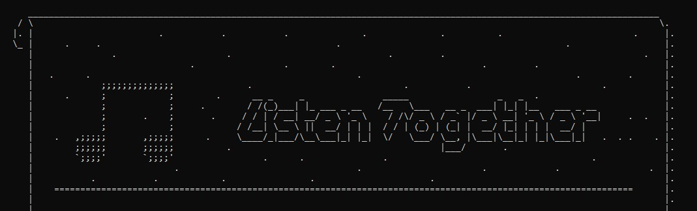

# :musical_note:Listen Together:musical_note:
.
## Descripcion
Listen Together es un reproductor de música de tipo midi multiusuario, que permite que usuarios de una misma red escuchen la misma música al mismo tiempo.

Listen Together también cuenta con las funciones de buscar canciones dentro de su repertorio local, de las cuales puede enseñar toda la información de la misma incluyendo la letra a la hora de reproducir la canción para que todos los oyentes puedan cantar juntos.

Hay 2 formas de usar la aplicación...

.

La primera es como director, en donde serás tú quien escoja las canciones y las opciones que todos verán.

.

La segunda es como oyente, en donde solo tendrás que dejar que el ritmo del director guíe vuestra fiesta músical

(PROXIMAMENTE AQUÍ HABRÁ UNA IMAGEN)

Actualmente la aplicación se encuentra en desarrollo, y cada vez con más pequeños secretos.

## Video Guía
- [Video Guia](https://www.youtube.com/watch?v=R8MweJQZMr8&ab_channel=MaryPoppinsM7)

## Miembros
* Julian Styven Colorado Agudelo
* Santiago Bautista Bustamante.

## Recursos
- [Markdown Cheatsheet](https://github.com/adam-p/markdown-here/wiki/Markdown-Cheatsheet#links).
- [Video guía de git y github](https://www.youtube.com/watch?v=sH9g77J92ns&ab_channel=CodeWar).
- [Guia de markdown](https://github.com/adam-p/markdown-here/wiki/Markdown-Cheatsheet)
- [Unicode table](https://unicode-table.com/en/)
- [Bitmidi](https://bitmidi.com/)
- [Música midi gratis](http://www.musicamidigratis.com/)
- [Midi world](https://www.midiworld.com/)
- [Video game music archive](http://www.vgmusic.com/)
- [Me gustas tu - Manu Chao](https://genius.com/Manu-chao-me-gustas-tu-lyrics)
- [Ejemplo datos en matriz](https://onlinegdb.com/r14vUiWvu)
- [StringBuilder](https://docs.oracle.com/javase/7/docs/api/java/lang/StringBuilder.html#replace(int,%20int,%20java.lang.String))
- [Tabla de caracteres Unicode](https://unicode-table.com/es/)
- [Tabla de caracteres latinos](https://ingmmurillo.blogspot.com/2012/05/tabla-de-caracteres-latinos-en-unicode.html)
- [Lectura de archivos grandes usando Stream](https://mkyong.com/java8/java-8-stream-read-a-file-line-by-line/)
- [Interfaz Stream](https://docs.oracle.com/javase/8/docs/api/java/util/stream/package-summary.html)
- [Ejemplos Stream](https://stackabuse.com/guide-to-java-streams-foreach-with-examples/)
- [Números aleatrios](https://memorynotfound.com/random-number-inclusive-exclusive-java/)

## Inspiración

- [Spotify - View lyrics](https://support.spotify.com/us/article/view-lyrics/)
- [Instagram - Writer Mode](https://about.instagram.com/es-la/blog/announcements/introducing-type-mode-in-stories#:~:text=Al%20abrir%20la%20c%C3%A1mara%2C%20ver%C3%A1s,estilos%20para%20cambiar%20la%20apariencia.)
